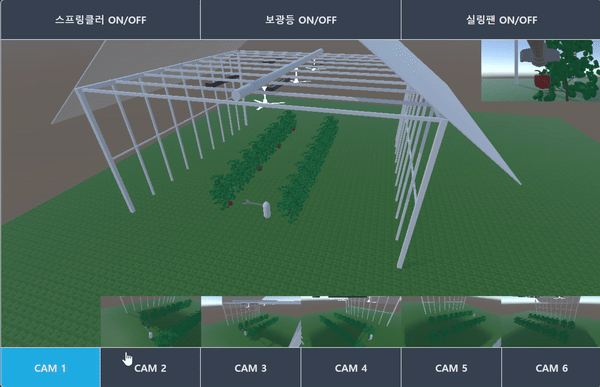
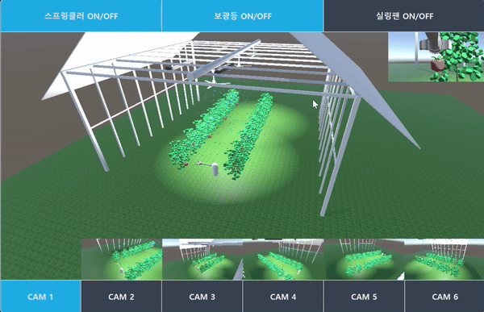
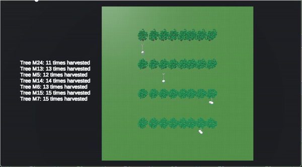
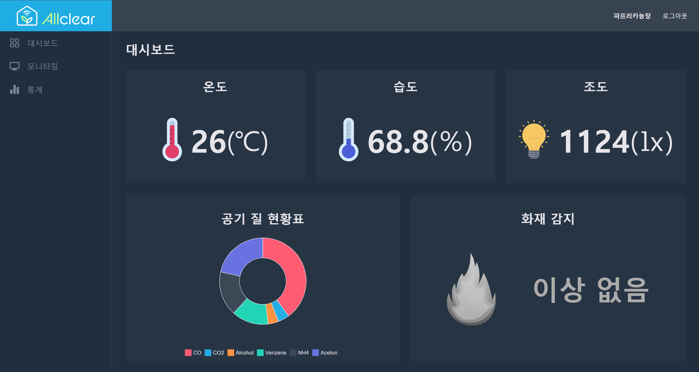
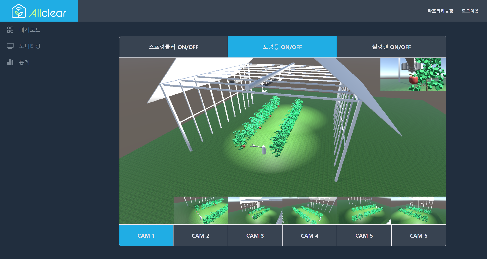
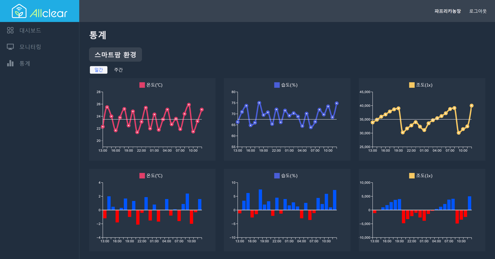
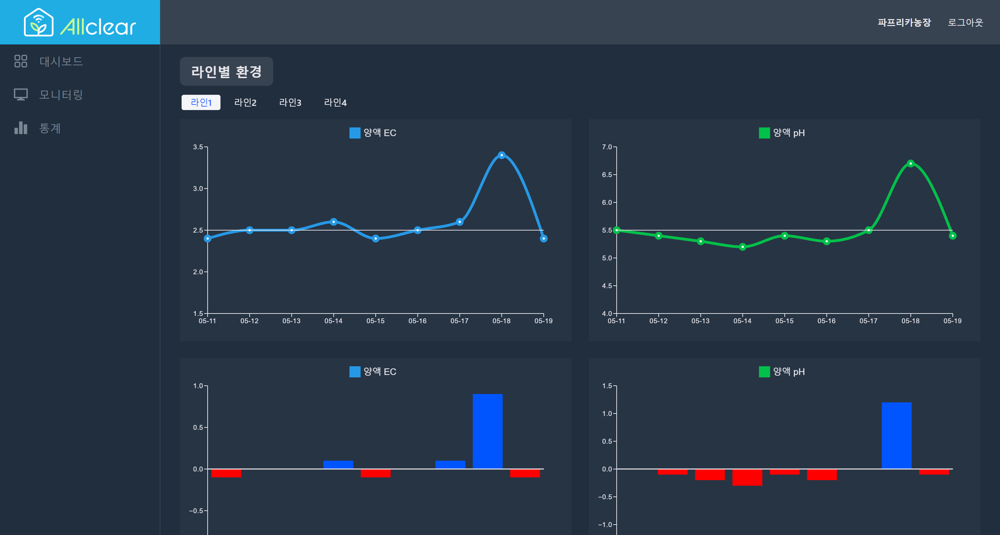
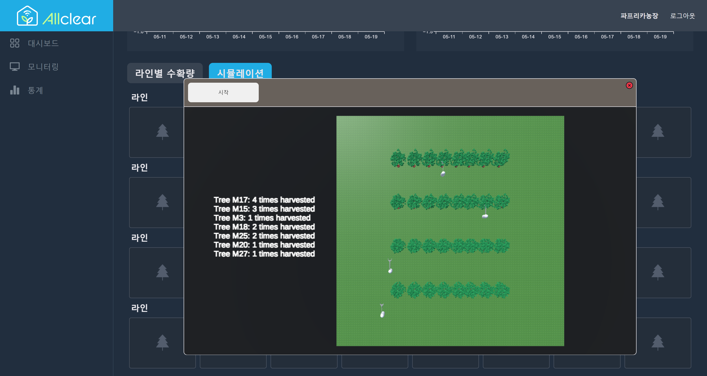
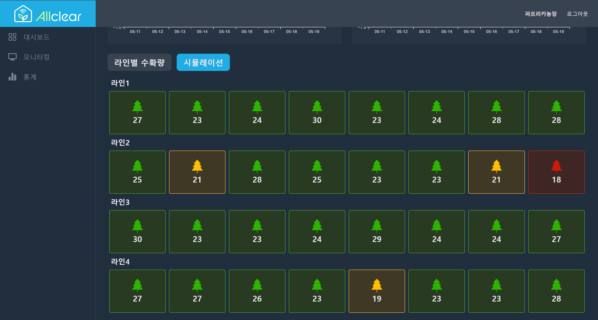

# [AllClear] - OnDevice AI 활용 자동수확 모듈 구현과 실시간 관제를 포함한 3차 스마트팜 구현 프로젝트

<br>

# 📖목차

-   [README](#readme)
    -   [✨ 프로젝트 소개](#-프로젝트-소개)
    -   [✨ 기획 배경](#-기획-배경)
    -   [💡 주요 기능](#-주요-기능)
        -   기능 1
    -   [📝 설계 문서](#-설계-문서)
        -   ERD
        -   기능 명세서
            -   API 명세서
    -   [🚧 서비스 아키텍쳐](#-서비스-아키텍쳐)
    -   [🛠 기술 스택](#-기술-스택)
    -   [📂 파일 구조](#-파일-구조)
        -   [🎥 시연 영상](#-시연-영상)
    -   [💾 결과물](#-결과물)
        -   [❤ 팀원 소개](#-팀원-소개)

<br>
<br>

## ✨프로젝트 진행 기간

삼성 청년 SW 아카데미 10기 2학기 자율 프로젝트 팀 B302

| 프로젝트 기간 | 2024.04.08 ~ 2024.05.24 (총 7주) |
| ------------- | -------------------------------- |

<br>

## ✨기획 배경

전 세계적인 이상 기후로 인해 스마트팜 산업이 매해 가파르게 성장하고 있으며 상승세를 이어가고 있습니다. 기사에서 보는 것과 같이 2026년 글로벌 44조 산업을 예측하고 있습니다. 대한민국 또한 스마트팜이 2013년 이후 증가추세를 보이고 있으며 꾸준한 성장세를 보이고 있습니다.

하지만 한국의 스마트팜 보급률은 1%정도에 달하며, 스마트팜 또한 1세대 위주의 정체된 세대교체를 보이고 있습니다.

따라서 이번 프로젝트에서는 대한민국에서도 짧은 기간내에 IT 개발로 3차 스마트팜의 비전을 제시하겠다는 목표를 설정하고 시작하게 되었습니다. 6주 개발 완성이라는 도전적인 목표를 설정하고 Unity, SSE, FastAPI, IoT(jetson nano), YOLO V8 model (AI) 를 통합한 MSA 프로젝트로 개발하여 실시간 관제와 자동 수확 무인화를 지향하는 3차 스마트팜 비전 제시하고자 합니다.

<br>

## 💡 주요 기능

### 1. On Device AI

-   YOLO V8 모델을 활용해서 파프리카의 수확 가능 여부를 판단하는 모델 생성
-   젯슨나노에 모델을 이식해서 기계 자체에서 판단하는 On Device AI 구현
-   Object Tracking 적용해서 처음 인식한 작물을 계속 추적하도록 구현

### 2. Simulation

-   Unity을 이용해 디지털 트윈 스마트팜 구현
-   자동 수확을 실시간으로 확인할 수 있도록 구현
-   수확 시뮬레이션 구현
-   수확 결과를 txt로 저장 가능

### 3. IoT

-   아두이노에 카메라와 로봇 팔을 부착해서 카메라 인식과 수확 하드웨어 구현
-   내장된 AI를 사용해서 파프리카를 인식하고 수확 가능한 경우 수확 프로세스 진행

### 4. Control

-   아두이노에 센서를 부착해서 주위의 환경 정보를 Scheduling을 사용해서 실시간으로 서버에 전송
-   서버에서 SSE를 사용해 웹페이지에서 확인 가능하도록 구현
-   온도, 습도, 조도, 대기 환경, 화재 감지 5가지 확인 가능

<br>

## YOLO v8 모델 학습

-   yolo v8n 모델을 사용해서 제작하기로 함.
-   학습 데이터는 AI Hub에 있는 데이터를 사용.
-   시설 작물 개체 이미지 ( 파프리카 볼로키 )
    -   https://aihub.or.kr/aihubdata/data/view.do?currMenu=115&topMenu=100&aihubDataSe=data&dataSetSn=237
-   지능형 스마트팜 통합 데이터(파프리카)
    -   https://aihub.or.kr/aihubdata/data/view.do?currMenu=&topMenu=&aihubDataSe=data&dataSetSn=535

#### 모델 학습 V1 버전

-   시설 작물 개체 이미지 ( 파프리카 볼로키 ) 데이터 사용.
-   데이터가 많아서 열매가 라벨링 되어있는 데이터만 학습 실행.

#### 모델 학습 V2 버전

-   V1 에서 라벨링 처리의 필요성을 깨닫고 "열매" 라벨링 데이터를 "착과기", "수확기" 2개의 라벨링으로 분리.
-   이미지의 크기를 리사이징해서 통일하고 회전시켜서 데이터를 추가하고 학습 실행.
-   사진에 있는 열매를 잡지 못하거나 착과기와 수확기를 잘못 판단하는 문제 발생.

#### 모델 학습 V3 버전

-   이번엔 열매 뿐만이 아닌 모든 데이터를 학습 실행.
-   V2와 마찬가지로 이미지 크기를 리사이징하고 이미지 회전으로 데이터를 추가.
-   "열매" 데이터에 비해 "잎", "줄기" 등의 데이터가 과하게 많은 문제를 발견.
-   줄기 부분을 열매로 착각하거나 열매 자체를 잘 잡지 못하는 문제가 발생.
-   데이터 상에서 수확이 가능한 걸로 보이는데 "착과기"로 라벨링 되어 있거나 반대로 덜 익은게 분명한데 "수확기"로 라벨링 된 데이터들을 발견.

#### 모델 학습 V4 버전

-   열매가 포함되어 있는 사진들을 전부 확인해서 수확 가능 여부를 판단하고 걸러주고 학습 실행.
-   수확 가능의 기준은 착색이 잘 되었는지를 기준으로 판단.
-   필터링 결과 수확 가능 사진이 250장, 나머지 11000장은 전부 수확 불가로 판단.
-   수확 가능과 불가능의 사진을 비슷한 비율로 맞추고 학습 실행.
-   인식 자체가 잘 안되고 특정 사진만 높은 수치가 나오는 모습 확인.

#### 모델 학습 V5 버전

-   이번엔 학습 데이터를 바꿔서 사용해보기로 함. 사용한 학습 데이터는 지능형 스마트팜 통합 데이터(파프리카) 를 사용.
-   열매 데이터만 학습 실행
-   해당 데이터에는 라벨링이 색깔 기준으로 판단하는 것을 확인. (초록색 / 초록색 이외의 색)
-   열매의 사진은 약 2.7 만장 정도 나오고 비율은 4 : 6 정도가 되도록 조정.
-   V4와 마찬가지로 사진을 하나씩 확인해서 수확 가능인데 덜 익은 것 같은 사진들은 제외.
-   학습 결과 파프리카는 잘 인식하고 수확 여부도 잘 파악하는 것을 확인.
-   착색이 덜 된 파프리카도 수확 가능으로 인식하는 문제 발견.
-   전체적인 학습 데이터 부족으로 파프리카 외의 다른 객체도 파프리카로 잘못 인식하는 문제 발견.
-   최종적으로 화면에 파프리카만 보이면 수확 가능 여부를 판단할 수 있어서 V5 모델을 프로젝트에 적용.

#### Object Tracking 적용

-   프로젝트의 특성상 파프리카를 인식하고 해당 파프리카의 위치 정보를 가져와야 하는데, 카메라가 움직이면 다른 파프리카를 인식하는 문제를 발견.
-   처음 인식한 파프리카만 계속 추적할 수 있도록 Object Tracking 기술을 적용.
-   적용 후 카메라가 조금 흔들려도 처음 인식한 객체만 추적하는 것을 확인.

<br>

<p align="center">
  
  
</p>
<br>

## Unity 시뮬레이션 구현

<br>

<p align="center">
  
  
  
</p>
<p>Webgl 라이브러리를 활용하여 유니티 시뮬레이션을 웹화면에서 버튼을 통해 Control 가능합니다</p>
<br>

## 서비스 화면

-   대시보드
    <br>

<p align="center">
  
</p>
<p>아두이노의 센서로 수집한 실시간 환경 정보를 확인할 수 있다.</p><br>

-   수확 모니터링
    <br>

<p align="center">
  
</p>
<p>실제 기계의 동작을 유니티로 확인할 수 있음</p>
<p>버튼으로 다양한 각도로 확인하거나 스마트팜 환경 변경 가능</p><br>

-   통계
    <br>

<p align="center">
  
</p>
<p>DB에 저장된 환경 정보를 일간, 주간으로 확인 가능</p><br>

-   라인별 통계
    <br>

<p align="center">
  
</p>
<p>각 라인별로 토양 산성 농도와 양액 투여량 확인 가능</p><br>

-   수확 시뮬레이션
    <br>

<p align="center">
  
</p>
<p>시뮬레이션을 통해 수확량 통계</p><br>

-   수확 시뮬레이션 결과
    <br>

<p align="center">
  
</p>
<p>시뮬레이션으로 통계낸 수확량을 각 라인의 나무별로 확인 가능</p><br>

## ERD

erdcloud 링크 : https://www.erdcloud.com/d/dSpuozhaMq3HKDLBp


<br>
<br>

## 📝 설계 문서

#### 기능 명세서

-   노션 링크 : https://dented-art-9c8.notion.site/12df40fc3e2e494aa0a3555370c28923?pvs=74

#### API 명세서

-   노션 링크 : https://dented-art-9c8.notion.site/API-fc1e66ac80274fe883e71f7b9e7fb990

<br>

## 🚧 서비스 아키텍쳐


<br>

## 🛠 기술 스택

### ☑Backend & AI

-   **Java** : 17.0.9
-   **Spring Boot** : 3.2.5
-   **JPA** : 3.25
-   **Python** : 3.9.13
-   **FastAPI** : 0.110.2
-   **MySQL(Maira DB)** : 8.0.34
-   **YOLO** : v8
-   **Spring Eureka** : 0.11.10

### ☑Frontend

-   **Node.js** : 20.11.1
-   **React** : 18.2.0
-   **Recoil** : 0.77
-   **Axios** : 1.6.8

### ☑Infra

-   **Kubernetes** : 1.29.4
-   **Calico** : 3.27.3
-   **Jenkins** : 2.452.1
-   **ArgoCD** : 2.11.0
-   **Grafana** : 10.4.1
-   **Prometheus** : 2.52.0
-   **Elastic Search** : 8.5.1
-   **Kibana** : 8.5.1
-   **Fluentd** : 1.16.2
-   **Nginx** : 1.18
-   **Nginx Ingress** : 1.10.0
-   **MetalLB** : 0.14.5
-   **Speaker(Frr)** : 9.0.2

### ☑협업 툴

-   GitLab
-   Notion
-   JIRA
-   MatterMost

<br>
<br>

## 📂 파일 구조

<details  style="margin-left: 5px;">
<summary><b>Python(Jetson nano)</b></summary>
<div>

```
📦python
┣ 📂pjt
┃ ┗ 📂websocket
┃   ┗ 📂app
┃   ┗ 📜best.pt
┃   ┗ 📜main.py
┃   ┗ 📜dockerfile
┃   ┗ 📜requirements.txt

```

</div>
</details>

<br>

<details  style="margin-left: 5px;">
<summary><b>BackEnd(SSE-service)</b></summary>
<div>

```
📦allclear
┣ 📂allclearsse
┃ ┣ 📂client
┃ ┃ ┗ 📜SensorServiceClient
┃ ┣ 📂config
┃ ┃ ┗ 📜Resilience4JConfiguration
┃ ┣ 📂controller
┃ ┃ ┣ 📜SseController
┃ ┃ ┣ 📜TestController
┃ ┃ ┗ 📜TestUserController
┃ ┣ 📂domain
┃ ┃ ┣ 📜DailyEnv
┃ ┃ ┣ 📜Farm
┃ ┃ ┣ 📜HourlyEnv
┃ ┃ ┗ 📜Yield
┃ ┣ 📂dto
┃ ┃ ┣ 📜FarmRequestDto
┃ ┃ ┣ 📜FarmResponseDto
┃ ┃ ┗ 📜SensorResponseDto
┃ ┣ 📂repository
┃ ┃ ┣ 📜SseDailyEnvRepository
┃ ┃ ┣ 📜SseHourlyEnvRepository
┃ ┃ ┗ 📜TestUserRepository
┃ ┣ 📂service
┃ ┃ ┣ 📜SseService
┃ ┃ ┗ 📜TestUserService
┃ ┗ 📜SseServiceApplication
```

</div>
</details>

<br>
<details  style="margin-left: 5px;">
<summary><b>FrontEnd</b></summary>
<div>

```
📦allclear
┣ 📂public
┃ ┣ 📂Build
┃ ┗ 📂Simul
┣ 📂src
┃ ┣ 📂apis
┃ ┣ 📂assets
┃ ┣ 📂components
┃ ┃ ┣ 📂line
┃ ┃ ┣ 📂period
┃ ┃ ┣ 📜Dashboard.jsx
┃ ┃ ┣ 📜Join.jsx
┃ ┃ ┣ 📜Login.jsx
┃ ┃ ┣ 📜Monitoring.jsx
┃ ┃ ┣ 📜Navbar.jsx
┃ ┃ ┣ 📜OpenVidu.jsx
┃ ┃ ┣ 📜Sidebar.jsx
┃ ┃ ┣ 📜Statistics.jsx
┃ ┃ ┗ 📜VideoStream.jsx
┃ ┣ 📂modules
┃ ┃ ┗ 📜useOpenVidu.jsx
┃ ┣ 📂recoil
┃ ┃ ┣ 📂dashboard
┃ ┃ ┣ 📂login
┃ ┃ ┗ 📂statistics
┃ ┣ 📜App.jsx
┃ ┗ 📜main.jsx
┣ 📜package-lock.json
┣ 📜package.json
┣ 📜vite.config.js
┣ 📜index.html
┣ 📜.env
┗ 📜.eslintrc.cjs
```

</div>
</details>
<br>

## 팀 구성

| 이름          | 역할                                            |
| ------------- | ----------------------------------------------- |
| 박성인 (팀장) | - Unity 시뮬레이션, FrontEnd<br>                |
| 김진우        | - BackEnd, AI<br>                               |
| 이용준        | - BackEnd, Entity 설계<br>                      |
| 이대영        | - BackEnd leader, Infra 구축, 프로젝트 관리<br> |
| 최재식        | - BackEnd, Jetson nano<br>                      |
| 이재문        | - FrontEnd leader, UI/UX<br>                    |

<br>
